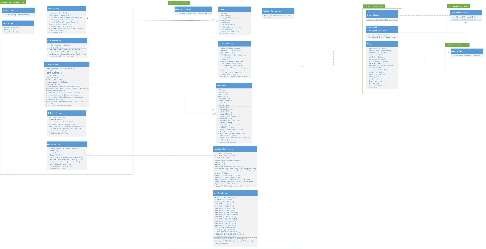
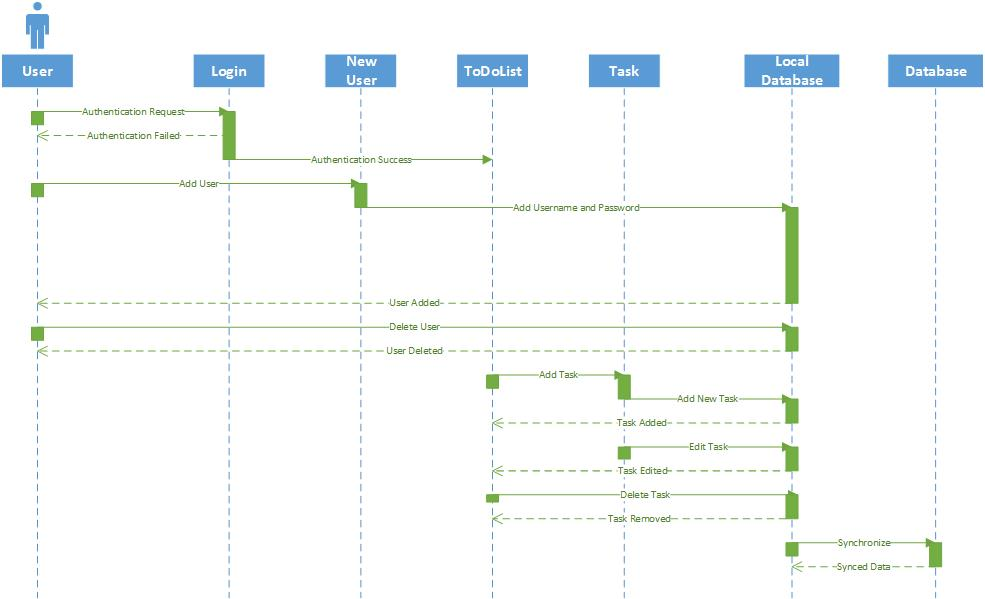

# Design Model 

## 1 Introduction
This design document mainly focuses on the ToDoOnTheGo Android app while at the same time touches on the possible expansion to a web application. Design, data flow, and relationships will all be discussed herein.

## 2 Class Diagram
The following represents the first draft of the class diagram. The main focus of this iteration is to completely flesh out all needed classes for the system as well as their functionality. Relationships are to be modeled in subsequent iterations.

## 3 Sequence Diagram
During typical use the following diagram will show the actions internal to the system that will be taken to complete each task. Both systems will follow this sequence of events. The only special case here is during the local database synchronization with the system database. This occurs in the Android application both automatically and when requested by the user.  

