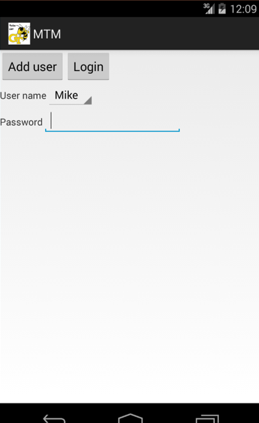
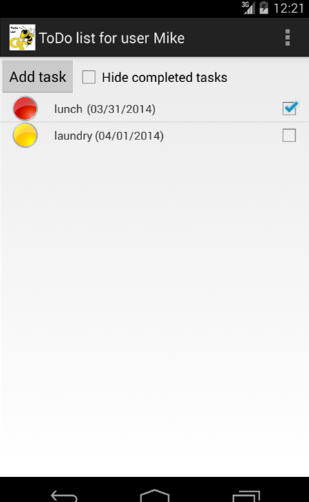
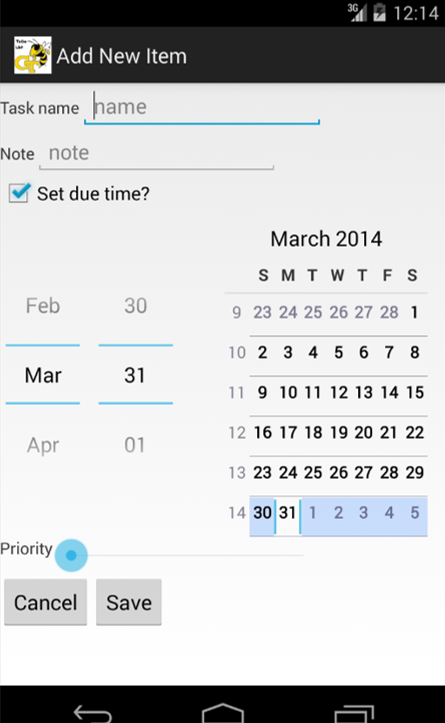
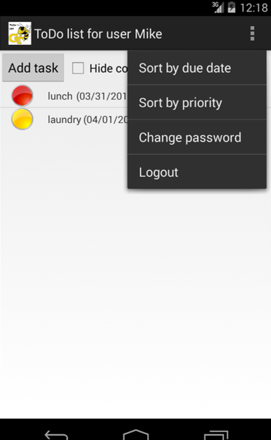

# User Documentation
## 1 Introduction
TODO On the Go is a system developed to make managing your everyday activities easy and intuitive. The following guide is designed to show you everything you need to know to take advantage of the Android application. There will be step by step guides to follow to carry out specific tasks, diagrams of what to expect in each application, and basic troubleshooting steps should something not go as expected.  

## 2 User Guide Table of Contents
<ol>
<li>Introduction </li>
<li>Table of Contents </li>
<li>Android Application</li>
<ol>
	<li>Navigation </li>
	<li>Adding a User </li>
	<li>Deleting a User</li>
	<li>Login to User</li>
	<li>Add a new task task</li>
	<li>Edit/Delete a task</li>
	<li>View All or Incomplete Tasks</li>
	<li>Sort TODO List</li>
	<li>Synchronize</li>
	<li>Change Password</li>
	<li>Log Out</li>
</ol>

<li>Troubleshooting</li>
</ol>

## 3 Android Application
### 3.1 Navigation

In general, to proceed forward in the application, tap on a list item or button. To return to a previous screen, press the back button on your Android device. Navigating the menu is as easy as tapping the menu button in the upper right corner and then tapping on the one of the displayed options.

### 3.2 Adding a User

<li>To add a user tap the "Add a New User" button on the interface. </li>

<li>Then type in the user name and password in the designated places. Enter in the same password in the confirm password section and hit "Add User" </li>

### 3.3 Delete User

On the Home screen hit the "Delete a User" button.

On the Delete User Screen select the User you wish to Delete. Then hit "yes" to confirm or "no" to cancel.

### 3.4 Logging in as a User

On the main screen tap on a user name from the drop down list and enter a password. Press "Login" and you will be taken the the TODO list screen.

### 3.5 Add a New Task

Tap "Add Task" on the TODO list Screen.

Fill in the appropriate fields for the Tasks including: Name, Due Date, Priority, Completion Status, and any Details desired and hit "Save". You can also hit "Cancel" if you do not wish to add a new task and go back to the TODO list screen.

### 3.6 Edit/Delete a Task

From the TODO list Screen tap on a task to see that task's details. From here you have the options to Edit or Delete the Task.

To Edit the Task select "Edit This Task" from the details screen. You will then be able to edit details such as Name, Due Date, Priority, and Completion Status.

This will take you back to the task screen just like adding a new task. Here you can update the properties of the task as desired.

To delete a task select the "Delete This Task" button. This will give you a Yes or No confirmation and will remove the task if you select "Yes". (Not final version.)

### 3.7 View All or Incomplete Tasks

The user can choose to mark a task as complete by placing a check mark in the box next to the Task. This allows the user to display only incomplete tasks or all tasks. On the TODO list screen with the tasks shown below check the "Hide complete tasks" box to show only those tasks without a completed check mark. You can uncheck this to show all tasks.

### 3.8 Sort TODO List

From the TODO list select the menu button in the upper right corner and then select the appropriate sorting method. You will be able to sort by priority or by due date. 

### 3.9 Synchronize 

Synchronization with the database happens automatically whenever you log in to your TODO list, make a change to your TODO list, and log out from your TODO list. In order to manually synchronize with the database select the menu button in the top right of the screen and select the appropriate option.**confirm

### 3.10 Change Password

To change your password select the menu button in the top right to the TODO list screen and then select the "change password" option. You must then enter the new password and confirm it for the change to be made. You may also cancel this at anytime by selecting the "cancel" button.**confirm

### 3.11 Log Out

In the TODO list screen, select the menu button, and then select the "logout" option.

## 4 Troubleshooting

General list related issues may be resolved by logging out and restarting the application. For more specific issues please contact me at 
livelovelearn818@gmail.com