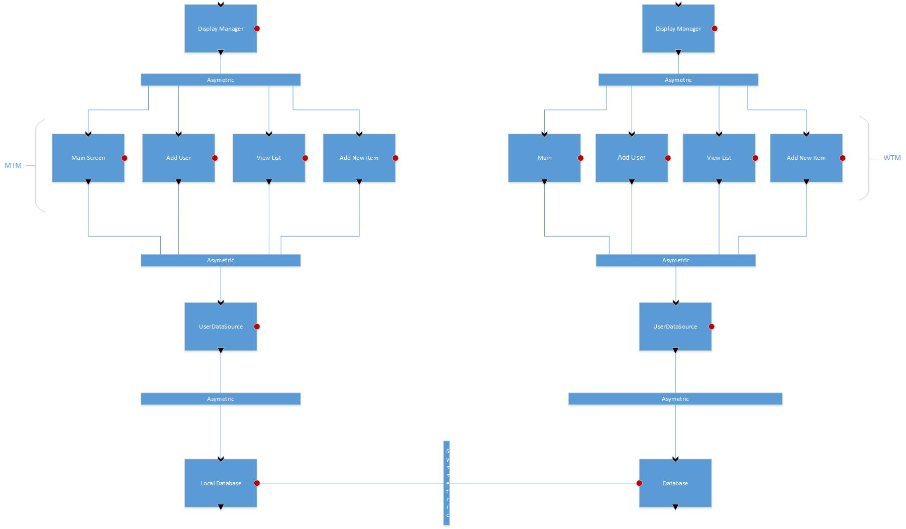
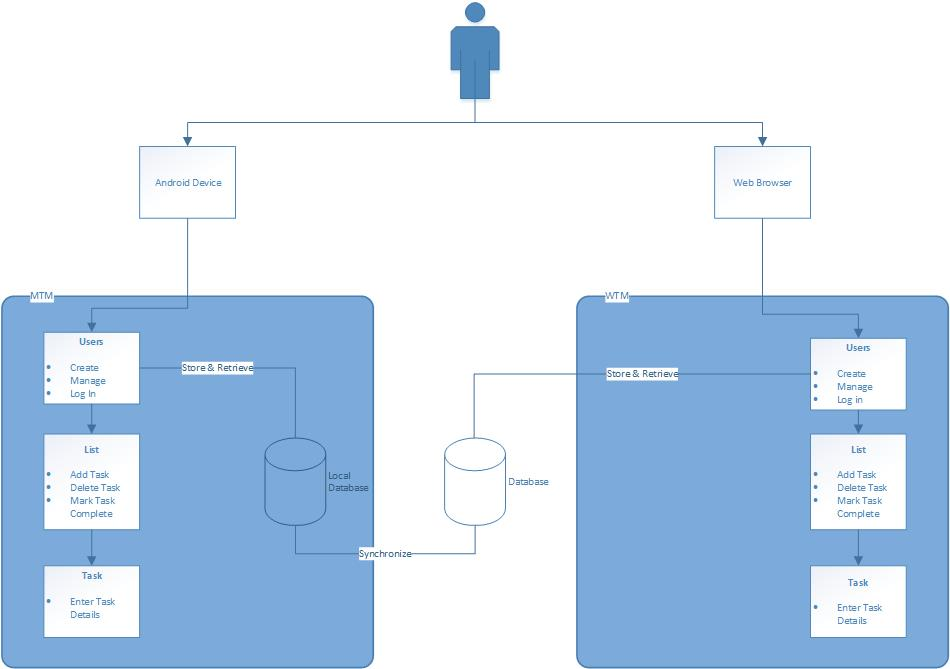

# Software Architecture - Team 22

## 1 Introduction
Thanks to the raving success of the TODO On The Go in the Android ecosystem there arose a desire to expand. In order to capture a wider user base and foster continued growth in usage of the application, TODO On The Go will become a fully fledged online productivity suite. Along with the current features of the application a web version will be created. These tools will mirror each other in every way in order to promote a seamless experience between the two. The following document will detail this proposed expansion made possible by the people of Initech. The following document will provide a high level look at the architecture of the new software system to be built. 

## 2 Architectural Design
The design of the app has been carried over from the previous project and expanded to include the new web interface.
 

As illustrated above the systems will mirror each other in form and function. In order to make for a seamless transition between the two data will be preserved in a database. This database will act as the main repository of all user data. The mobile application will retain its local database as it had in the previous version, and will sync with the main database periodically. Another item to note is the difference in the display managers for each application. The mobile applications display will be governed by the android operating system. On the other hand, the web interface will have its display managed by the web browser used to access the application.
Despite these differences each application will retain the same look and feel with the same functionality as described in the following section.
 
### 2.1 Main Component Overview
<ol>
<li>Startup Screen-This screen will display the Users and corresponding names and have the buttons and methods to add or delete users and activating a user will lead to a login screen before continuing.</li>
<li>Add User- This section will consist of a screen to add new users with username and password and the methods to support this.</li>
<li>Login- This section will consist of a screen where the user can login with their password and will contain the methods to authorize a user.</li>
<li>List Screen- This section will contain a UI screen with the tasks listed and options to add and delete tasks, check completed tasks, and show checked or all tasks. This section will include the methods to support these options.</li>
<li>Task Screen- This section contains a UI screen with a Task Name, Due date, Priority, and Details and the methods to support this functionality. The tasks should also be saved in this section.
</ol>

### 2.2 Rationale
The original system was designed to be used quickly and easily by the user. With the new expansion the intent to give more accessibility to the system. A user will be able to access their information from anywhere and have this information preserved and instantly moved between each different application. Designing the architecture in this way makes for a portable application that is convenient and functional for all types of users.The specifics on how this system is expected to preform is detailed in the following section.

## 3 Conceptual View

The flow from each component is as follows:

1. Application opens and the user either selects and existing user or adds a user.
	1. When the user is adding a new user application goes to the add user screen, and returns to step 1 after completing.
2. Application goes to the login screen. User provides credentials.
3. After the user is authenticated application goes to the list screen. Existing tasks are displayed.
	1. User may add a new task. Application will go to task screen and then return here.
	2. User may mark a task as complete.
	3. User may delete a task. Application will go to task screen and then return here.
	4. User may sync with the main database here on the android application.

