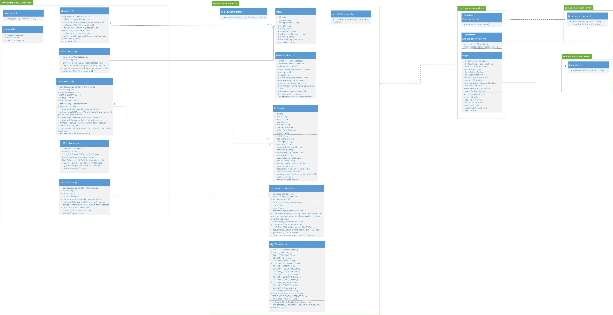
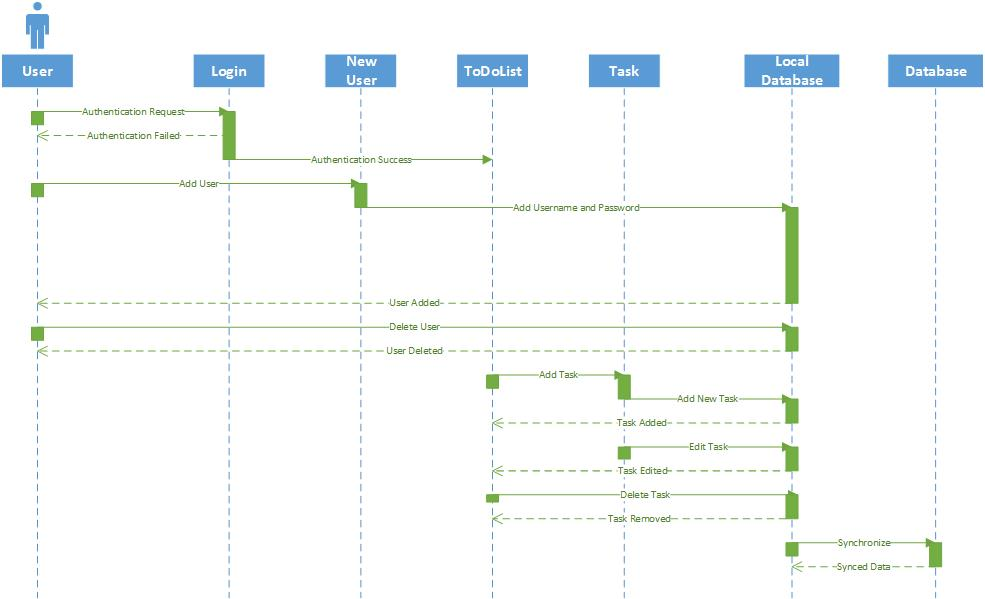

# Design Model - Team 22

## 1 Introduction
Thanks to the raving success of the TODO On The Go in the Android ecosystem there arose a desire to expand. In order to capture a wider user base and foster continued growth in usage of the application, TODO On The Go will become a fully fledged online productivity suite. Along with the current features of the application a web version will be created. These tools will mirror each other in every way in order to promote a seamless experience between the two. The following document will detail this proposed expansion made possible by the people of Initech. In this document the lowest level components will be the main focus. Design, data flow, and relationships will all be discussed herein.

## 2 Low Level Design

### 2.1 Class Diagram
The following represents the first draft of the class diagram. The main focus of this iteration is to completely flesh out all needed classes for the system as well as their functionality. Relationships are to be modeled in subsequent iterations.

### 2.2 Sequence Diagram
During typical use the following diagram will show the actions internal to the system that will be taken to complete each task. Both systems will follow this sequence of events. The only special case here is during the local database synchronization with the system database. This occurs in the Android application both automatically and when requested by the user.  

### 2.3 Database Modeling
The following section will display the architecture of the database schema to be used in TODO On The Go. This diagram will model both the Android application's local database as well as the main database for the system. The entity relationships are to be modeled in a follow up iteration to this document.

